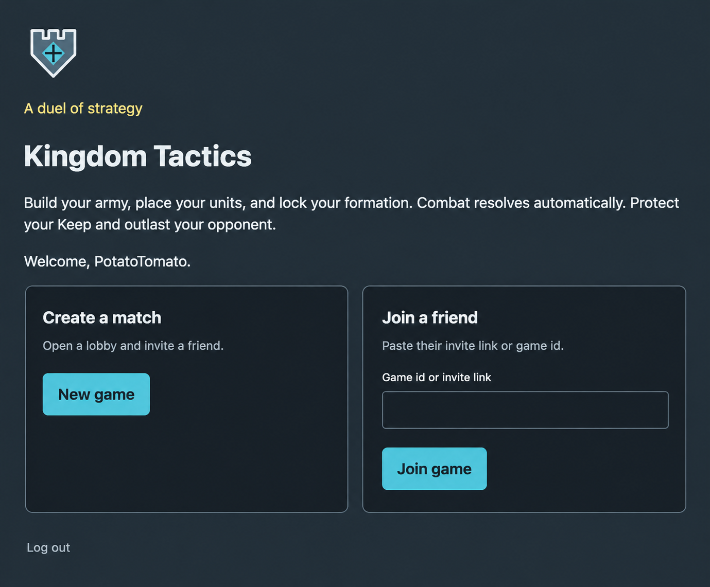

# Kingdom Tactics

**[Play the live game](https://kingdom-tactics.vercel.app)**

> **Hosting note:** This project is hosted on Render's free tier. The backend automatically sleeps after 15 minutes of inactivity, so the first visit may take 30–60 seconds to load. Subsequent requests should be much faster once the server is awake.

[](https://github.com/YuchenForge/Kingdom-Tactics/actions/workflows/backend.yml)
[](https://github.com/YuchenForge/Kingdom-Tactics/actions/workflows/frontend.yml)
[](https://github.com/YuchenForge/Kingdom-Tactics/actions/workflows/e2e.yml)

A 1v1 server-authoritative tactical auto-battler. You recruit units from a rotating shop, place them on a private board, and lock the formation. The backend runs deterministic combat, persists the result, and both players watch the same recorded battle.

This is a portfolio project: transactional round resolution, a framework-free combat engine, secure command handling, and a deployed full stack.



## Play

1. Open [kingdom-tactics.vercel.app](https://kingdom-tactics.vercel.app) and create an account.
2. Create a match and send the invite link to a second browser (or a friend).
3. Recruit, place, and lock. Combat plays automatically when both players lock or the planning timer ends.
4. A match lasts up to 8 rounds. Reduce the opponent's Keep to 0, or finish with more Keep HP. Equal Keep HP is broken by remaining gold, then a draw.

## Quick links

- **[Game rules](docs/rules.md)**
- **[Architecture](docs/architecture.md)**
- **[State machine](docs/state-machine.md)**
- **[Combat scenarios](docs/combat-scenarios.md)**
- **[API contract](docs/api-contract.md)**
- **[Database schema](docs/database-schema.md)**
- **[Roadmap](ROADMAP.md)** — delivered scope and possible next steps
- **[Deployment](deployment/README.md)**

## Tech stack

| Layer | Technology |
|-------|------------|
| Frontend | React, TypeScript, Vite, Tailwind CSS, TanStack Query |
| Backend | Java 21, Spring Boot 3, PostgreSQL, Flyway |
| Combat engine | Pure Java, no framework dependencies |
| Testing | JUnit 5, Testcontainers, Vitest, Playwright |
| Delivery | Docker Compose, GitHub Actions, Vercel, Render |

## Architecture

```
React + TypeScript client
  ├─ TanStack Query polls server state
  ├─ Local selection and drag stay in the browser
  └─ Combat animation plays recorded events on a shared clock
            │
            ▼
Java / Spring Boot  (API and round worker in one process)
  ├─ Authenticated commands and game queries
  ├─ Claim LOCKED rounds, run the combat engine, persist once
  └─ Advance to the next preparation or the match result
            │
            ▼
PostgreSQL
  users, games, rounds, commands, events, snapshots
```

The combat engine does not talk to HTTP or the database. The same seed, board, and rules version always produce the same events, so a match can be replayed from what was stored.

1. **Server-authoritative state** — commands are validated and combat is computed on the server.
2. **Event log and snapshots** — each round retains commands, combat events, and final snapshots.
3. **Deterministic combat** — integer stats, fixed ticks, and stable tie-breaks reproduce the same outcome.

Production runs the API and worker jobs in one Render service. The worker module can still run as its own process. Details are in [deployment/README.md](deployment/README.md).

## Run locally

Install Docker with Compose. From a fresh checkout:

```bash
docker compose up --build -d --wait
```

Open **http://localhost:5173**. Use two browsers, or a normal window and a private window, to register two accounts and play. No local Java, Maven, Node, or `.env` file is required. The first build downloads dependencies and can take several minutes.

Compose starts PostgreSQL, then the combined API and worker (which applies Flyway migrations), then the frontend after `/health` passes. The frontend serves a production build and proxies `/api` to the API. Nested page URLs still work after refresh.

```bash
docker compose ps
docker compose logs -f api
curl --fail http://localhost:8080/health
docker compose down
```

`docker compose down` keeps accounts and matches in the `postgres_data` volume. `docker compose down --volumes` deletes that data. Database credentials and the JWT secret in `docker-compose.yml` are local defaults and are not for a public deployment.

Ports default to frontend 5173, API 8080, and database 5432, bound to localhost:

```bash
KT_WEB_PORT=5174 KT_API_PORT=8081 KT_DB_PORT=5433 docker compose up --build -d --wait
```

Use the same overrides for later Compose commands. After source changes, rerun the startup command. Container mode does not hot reload.

### Hot reload

Requires Java 21, Maven 3.9+, and Node.js 22.12+, plus Docker for Postgres. Stop the full Compose stack before using the same ports on the host.

```bash
docker compose up -d postgres
cd backend
mvn install -DskipTests
mvn -pl combined spring-boot:run
# another terminal, in frontend/
npm ci
npm run dev
```

`VITE_API_BASE_URL=/api` is the default. Vite proxies it to port 8080. Do not combine `-am` with `spring-boot:run`, and do not start the standalone API or worker next to the combined process.

To run API and worker as two processes instead:

```bash
KT_API_DOCKERFILE=api/Dockerfile docker compose --profile separate-worker up --build -d --wait
```

## Tests

Backend, from `backend/` (Docker is required for Testcontainers):

```bash
mvn test
```

Frontend, from `frontend/`:

```bash
npm ci
npm test
npm run lint
npm run build
```

The multiplayer end-to-end workflow builds the combined backend, frontend, and PostgreSQL, then uses two Chromium sessions to register, invite, recruit, lock, watch combat, and finish a match. Nothing in that path is mocked.

To run it locally against a disposable stack:

```bash
KT_WEB_PORT=15173 KT_API_PORT=18080 KT_DB_PORT=15432 docker compose -p kt-e2e up --build -d --wait
cd frontend
npm ci
npx playwright install chromium
npm run test:e2e
```

The test defaults to `http://127.0.0.1:15173`. Override `E2E_BASE_URL` for another stack. Allow up to 12 minutes for a full eight-round match. Remove only that stack when finished:

```bash
cd ..  # return from frontend/ to the repository root
KT_WEB_PORT=15173 KT_API_PORT=18080 KT_DB_PORT=15432 docker compose -p kt-e2e down --volumes
```

## Rules at a glance

- **Players:** 2
- **Match length:** up to 8 rounds
- **Board:** 4×4 placement grid per player, merged into a 4×8 combat board (player 0 rotated 180°)
- **Holding lane:** 5 slots per player for purchases before placement
- **Starting Keep HP:** 20
- **Starting gold:** 10
- **Units:** Squire, Shieldbearer, Ranger, Knight, Mage, Healer
- **Win:** opponent Keep HP reaches 0, or higher Keep HP after round 8

Full rules: [docs/rules.md](docs/rules.md).

## Project phases

| Phase | Goal | Status |
|-------|------|--------|
| **0** | Design and specification | Complete |
| **1** | Pure combat engine | Complete |
| **2** | Backend foundation | Complete |
| **3** | Planning and commands | Complete |
| **4** | Worker and resolution | Complete |
| **5** | Frontend | Complete |
| **6** | Combat animation | Complete |
| **7** | Deploy and polish | Complete |

See [ROADMAP.md](ROADMAP.md).

## License

[MIT](LICENSE)
